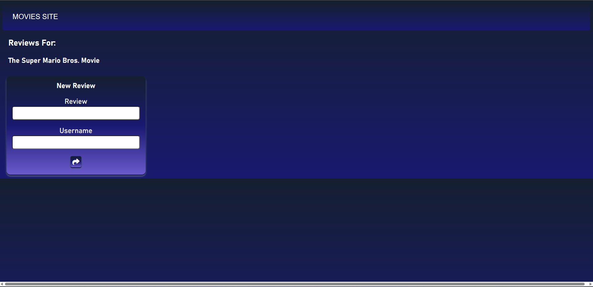

# Movie-App
### This is an application that allows you to find and leave a review on the movie of your choice created with HTML, CSS, JavaScript, MongoDB.

Firstly, to run the application you'll have to run the html file on your local browser using the IDE of your choice.

Upon launch, it will bring you to the homepage where you are presented with the most recent/popular movies out currently in theatres and on entertainment services.

You're given the option to select the reviews button which is the little comment icon below the movie title, which will direct you to the reviews page for the chosen movie. You can also go back to the homepage by clicking on the 'MOVIES SITE' label upper left.

You can enter your review along with a username and select the share button to post it in the thread.

You're then given the option to edit that comment by clicking the small button on the left, or delete/erase that comment by clicking the button on the right.

And to find the movie of your choice you simply have to type in the movie title in the search bar on the upper right and hit enter.

